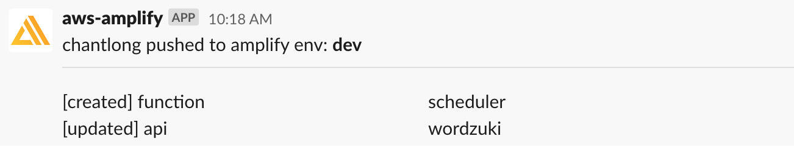

## Introduction

An amplify plugin that notifies your Slack Channel whenever `amplify push` is triggered from your CLI locally.

## Installation

```
npm i -g amplify-push-slack-notifier-plugin
```

## Prerequisite

Install Amplify CLI globally if you have not already.

```
npm i -g @aws-amplify/cli
```

The following environmental variables need to be setup beforehand.

```
AWS_ACCESS_KEY
AWS_SECRET_KEY
AMPLIFY_SLACK_WEBHOOK_URL
```

Create a [Slack App](https://api.slack.com/apps) and add an Incoming Webhook, then copy the Webhook URL to be used in `AMPLIFY_SLACK_WEBHOOK_URL`.

From the root of your amplify project run

```
amplify plugin add amplify-push-slack-notifier-plugin
```

Now whenever `amplify push` is performed from the Amplify CLI, it will send a message to your specified Slack Channel in the following format.

1. `<AWS USERNAME> pushed to amplify env: <AMPLIFY ENV>`
2. Changes that have been made.



## Updating the Plugin

```
npm i -g amplify-push-slack-notifier-plugin@latest

```

From the root of your amplify project run

```
amplify plugin add amplify-push-slack-notifier-plugin
```